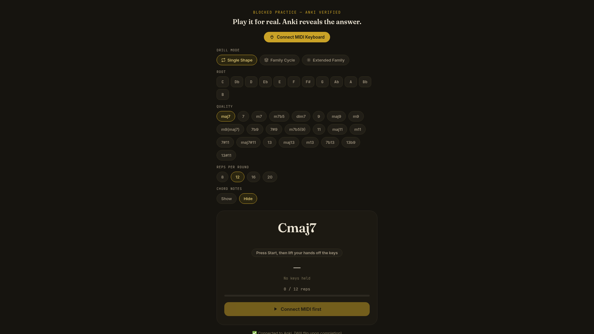

# Anki MIDI Chord Trainer

A multi-tool setup for drilling chords and progressions on a MIDI keyboard with Anki integration. Use the **HTML apps** for timed, repetitive practice sessions, or the **Python script** for hands-free Anki card reviews.

**Live site (GitHub Pages):** https://justinjoshi.github.io/anki-midi-chord-trainer/



---

## What's in this repo

| File | What it is |
|------|-----------|
| `reflexDrillExt.html` | Main web app — blocked-practice chord drill with timer, stats, AnkiConnect flip, and optional time-based auto-grading. Includes **Welcome**, **Chord Drill**, **Arpeggios**, **Root Cycling**, and **Tracking** tabs, plus a link to the Progression Drill. |
| `progression-drill.html` | Companion web app — ii-V-I and 12-bar blues progression drill with loop timing. Shares the same top navigation bar so it feels like part of the same site. |
| `chord-symbols-CGDAEno11.txt` | Ready-to-import Anki deck — root-position 7ths and dim7 in C, G, D, A, E (tab-separated Basic notetype) |
| `chord-symbols-CGDAE.txt` | Ready-to-import Anki deck — extended 9/11/13 voicings with LH/RH fingering in C, G, D, A, E (tab-separated Basic notetype) |
| `anki_midi_chord_trainer.py` | Python script — auto-checks your played chords against Anki cards during reviews |

---

## How the two tools work together

All tools listen to your **MIDI keyboard**, but they serve different practice goals:

### `reflexDrillExt.html` — Blocked Practice Drill

Best for **speed and muscle-memory drilling** on a single chord or chord family.

- Open it in any browser (served locally via `python3 -m http.server`).
- Use the **Welcome** tab to read the landing page, the **Chord Drill** tab to drill full chords, the **Arpeggios** tab to drill arpeggio cells, the **Root Cycling** tab to drill random roots, or the **Progression** link to switch to the progression drill.
- Connect your MIDI keyboard and pick a chord (root + quality).
- Press **Start**, lift your hands, then play the chord as fast as you can.
- The timer starts the moment you release all keys and stops when you play the correct notes.
- Do **N reps** (1 / 5 / 8 / 12 / 16 / 20, or any custom number) per round. It tracks your **best single rep** and **best round average**.
- When you finish a round, it **automatically flips the current Anki card** so you can grade it.
- Modes:
  - **Single Shape** — drill one specific chord
  - **Family Cycle** — cycle through maj7 → 7 → m7 → m7b5 → dim7
  - **Extended Family** — include 9ths, 11ths, and 13ths
- Toggle **Show/Hide** chord notes if you want to test recognition vs. muscle memory.
- **Show new notes** — when Chord Notes is hidden, automatically reveal the notes for any card Anki labels as **new**, so you can learn the voicing the first time you see it. Learning and review cards stay hidden.
- **New card reps** — when on, cards Anki labels as **new** use a separate, higher rep count instead of your normal Reps per round, so brand-new voicings get more repetitions before the round completes. Learning and review cards keep the normal count. The boost value is customizable and persists across sessions.
- **Require exact notes** — when on, any extra notes besides the expected chord make the attempt fail; when off, extra notes are allowed as long as all required notes are present.
- **Reveal on Finish** — even with chord notes hidden, briefly show them the moment you complete a round to confirm what you played without giving the answer away beforehand.
- **Countdown on Start** — when on, clicking **Start** runs the same countdown used by Automatic Timer before the timer begins.
- **Hover tooltips** — every control label has a `?` tooltip explaining what it does, so the UI is self-documenting.
- **Anki Sync** — turn on "Follow card" and the app polls AnkiConnect for the current review card. When the card changes, the app parses the chord on the front (e.g. `Gm7`, `Cmaj7`, `F#m9(maj7)`) and automatically selects it for you.
  - On the **first successful connection** each session, the app applies recommended hands-free defaults: Automatic Timer On, countdown 3 s, Hide Until Go On, Break Before Grading 5 s (tick muted), and Auto-Grade On. This only happens once per Follow toggle, so it won't overwrite settings you change by hand.
  - Shows a row of colored deck-stat pills (new / learning / due counts) directly below the grade-status badge for the deck the current card belongs to. Stats refresh when Follow card is turned on, on every new card, and after a successful auto-grade.
  - The app also asks AnkiConnect for the current card's queue/type, so it knows whether the card is **new**, **learning**, or **review**. This powers the **Show new notes** toggle (new cards reveal their notes even when Chord Notes is hidden) and the **New card reps** toggle (new cards can use a higher rep count to build initial muscle memory).
- **Automatic Timer** — when Anki Sync is following a card, a new card automatically triggers a countdown and starts the drill hands-free.
  - The countdown length is editable (default 3 s) and persists across sessions.
  - **Hide until go** masks the big chord symbol and the Anki Sync status line during the countdown, then reveals them the instant the timer starts.
- **Break Before Grading** — after a round finishes, optionally wait a configurable number of seconds before flipping/grading the Anki card.
  - Shows a visible "Grading in N…" countdown in the complete box.
  - A bell toggle next to the break-seconds field enables or mutes the ticking sound during that countdown.
  - Hitting **Redo**, **Next chord**, or **Stop** mid-break cancels the countdown so the app never grades a card you've already moved past.
- **Auto-Grade** — when a round finishes, the app flips the Anki card and can automatically submit a grade based on your first-chord reaction time:
  - **Good** if under the "good" threshold (default 2.0 s)
  - **Hard** if under the "hard" threshold (default 4.0 s)
  - **Again** otherwise
  - A persistent grade status badge above the chord card shows **No grade sent yet** → **Sending to Anki…** → **Last sent: Good (1.42 s)** and stays on screen until the next grade actually replaces it. The current deck's new / learning / due counts sit centered directly below this badge.
  - **Celebrate Good** toggle (persisted) fires a brief confetti burst when your first-chord time is faster than your "good" threshold.
  - Thresholds, break seconds, countdown seconds, and the break-countdown tick-sound preference all persist across sessions. The Auto-Grade, Automatic Timer, Hide-until-go, and Anki Sync toggles themselves reset to off on reload so nothing auto-grades or auto-hides silently.
- **Arpeggios tab** — practice 7-note minor-11 arpeggio cells with a two-phase drill:
  - Twelve built-in chords (e.g. `Bbm11`, `Fm11`, `Gm11`) in a default order; customize which chords are included and reorder them with up/down arrows.
  - **Root phase:** hold the left-hand pedal to arm the timer. Each chord uses the voicing given in the source table — most are root + 5th, some add the b7, and one (`F#m11`) is root + b7 with no 5th.
  - **Sequence phase:** play each note of the right-hand cell in order. The cell loops indefinitely until you hit **Next chord**.
  - Live display shows the next target note/degree, a 7-chip position strip, lap count, miss count, and a scrolling transition-time history.
  - Shares the same MIDI connection as the Chord Drill tab — connect MIDI once and it works for both.
  - **Show LH notes** toggle (persisted): when off, only the chord symbol is shown and you have to remember the left-hand pedal voicing yourself.
  - **Flash on Miss** toggle (persisted): a wrong note during the sequence briefly flashes the target display red and is logged for review.
  - **Anki Sync** — turn on "Follow card" and the app polls AnkiConnect for the current review card, matches it by root to the corresponding minor-11th arpeggio (e.g. any `G` chord → `Gm11`), and loads it automatically.
    - On the **first successful connection** each session, the app applies the same hands-free defaults as the Chord Drill tab: Automatic Timer On, countdown 3 s, Hide Until Go On, Break Before Grading 5 s (tick muted), and Auto-Grade On.
    - **Automatic Timer** — a new Anki card triggers the countdown, then the drill arms itself (no manual Restart needed).
    - **Hide until go** masks the chord symbol, LH notes, and sequence chips during the countdown.
    - **Break Before Grading** — after you complete one full lap, the app waits the configured seconds before flipping/grading the Anki card.
    - **Auto-Grade** — grades the Anki card by the number of missed notes in the lap, not by time. Customize the miss thresholds: defaults are 0 misses → Good, 1–2 misses → Hard, 3+ misses → Again.
    - A persistent grade status badge and centered deck-stat pills (new / learning / due) appear above the arpeggio card, same styling as the Chord Drill tab.
- **Root Cycling tab** — drill one fixed idea across random roots, so you're testing "can I find this anywhere" instead of "do I know this shape in order":
  - **Chord mode** — pick a quality (e.g. `m7`) and play it as a block chord in a random key each rep.
  - **Arpeggio mode** — drill the canonical minor-11th shape transposed to a random root each rep.
  - Customize which of the 12 roots are eligible; the same root never repeats back-to-back.
  - Reaction times are logged to their own localStorage key and shown in the **Tracking → Root Cycling** sub-tab.
- **Tracking tab** — split into **Chord Drill**, **Arpeggios**, and **Root Cycling** sub-tabs:
  - **Chord Drill** tracker: every first-chord attempt is logged to a separate localStorage key so you can visualize progress over time, without disturbing the rolling-best stats.
    - Each log entry stores the chord symbol, reaction time, timestamp, redo flag, and (once known) the Anki grade.
    - Grades are patched onto the entry **after** the round completes and Auto-Grade succeeds; attempts without Auto-Grade stay "ungraded".
    - Redo attempts count, but render as hollow rings so you can distinguish them from first tries.
    - Click any chord in the left-hand list to see an SVG time-series chart of every attempt, colored by grade.
    - The chart shows a connecting trend line, hover tooltips with exact time/date/grade, and faint dashed reference lines at your current Good/Hard thresholds.
    - Logs are capped at the most recent 5,000 entries to keep localStorage healthy.
    - Use **Clear this chord's log** to remove entries for the selected chord.
  - **Arpeggios** tracker: review every transition you practiced.
    - Left list shows one row per chord transition (`chord · from→to`), e.g. `Bbm11 · Root→9`, with attempt count, average time, and a red miss-count badge.
    - Click a transition to see an SVG time-series chart of its transition times plus a breakdown of exactly which wrong notes were played instead (e.g. "played D instead (×2)").
    - Transitions that only have misses and no successful attempts still appear, so weak spots don't get hidden.
    - Miss events and successful transitions are stored in separate localStorage keys, each capped to keep storage healthy.
  - **Root Cycling** tracker: review random-root reaction times.
    - Left list groups attempts by the fixed idea drilled, not by root — e.g. `Chord · m7` or `Arpeggio · 9→b3` — so you see whether you're getting faster at the *shape* across all keys.
    - Click an idea to see an SVG time-series chart of every attempt; hover any point to see exactly which root that attempt was in.
    - A root-breakdown line shows how many times you've practiced each root for the selected idea, so you can spot uneven coverage.
    - Logs are capped at the most recent 5,000 entries.

### `progression-drill.html` — Progression Drill

Best for **moving between chords smoothly** in a harmonic context, not just one chord at a time.

- Open it from the **Progression** link in `reflexDrillExt.html`, or directly in any browser (served locally via `python3 -m http.server`).
- Connect your MIDI keyboard and pick a **progression** and **key**:
  - **ii-V-I** — cycle through ii → V → I (e.g. Dm7 → G7 → Cmaj7 in C)
  - **12-Bar Blues** — standard blues form in the chosen key
- Press **Start Loop**, lift your hands, then play each chord in the sequence as it appears.
- The timer tracks each **individual chord transition**.
- After you hit the last chord, the loop **auto-restarts** so you can keep going.
- Tracks **loop count**, **best single transition**, and **best loop average**.
- Shows the **matching scale** for your right hand (Dorian for m7, Mixolydian for dom7, Ionian for maj7).
- Uses Tone.js for audio chimes on each correct chord and loop completion.
- Hover over the **Progression** and **Key** labels to see tooltip explanations of what each control does and how practice history is tracked.

**How to practice with it:**
1. Start with left hand only — comp the chords as block chords, focusing on smooth motion between shapes.
2. Add the right hand — run the scale shown for each chord, switching the instant the chord changes.
3. Loop with a metronome at slow tempo, increase only when clean.
4. Cycle through keys (C, G, D, A, E) using the same process.
5. Add the 12-Bar Blues alongside ii-V-I for a second harmonic vehicle.
6. Finally, practice against real backing tracks for tempo and time-feel.

### `anki_midi_chord_trainer.py` — Review Mode

Best for **actual Anki review sessions** where you want the computer to check your answer.

- Run the script while reviewing a deck in Anki.
- It reads the **correct chord notes** from the current card's field (configurable regex).
- Play the chord on your keyboard. After a short debounce, the script compares what you played vs. what's expected.
- **Correct** → flips the card so you can grade it (Again / Hard / Good / Easy).
- **Wrong** → prints which notes are missing or extra; try again.

### When to use which

| Goal | Tool |
|------|------|
| Drill one chord for speed | `reflexDrillExt.html` |
| Cycle through chord families | `reflexDrillExt.html` |
| Track rep times and PBs | `reflexDrillExt.html` |
| Drill minor-11 arpeggio cells | `reflexDrillExt.html` |
| Drill random-root chord/arpeggio recall | `reflexDrillExt.html` |
| Import companion Anki deck | `chord-symbols-CGDAEno11.txt` / `chord-symbols-CGDAE.txt` |
| Practice ii-V-I transitions | `progression-drill.html` |
| Practice 12-bar blues form | `progression-drill.html` |
| Loop progressions with timing | `progression-drill.html` |
| Review a structured Anki deck | `anki_midi_chord_trainer.py` |
| Let the computer grade your answer | `anki_midi_chord_trainer.py` |

---

## Requirements

| Component | Version / Notes |
|-----------|-----------------|
| Anki Desktop | 2.1.45+ (AnkiConnect requirement) |
| AnkiConnect | Add-on code `2055492159` |
| Python | 3.8+ (for the script) |
| MIDI keyboard | Any USB-MIDI device |
| Browser | Any modern browser with Web MIDI support (Chromium/Chrome/Firefox/Edge) |

---

## HTML App Setup

Both HTML apps need to be served locally for Web MIDI to work. You can also use the GitHub Pages deployment for a quick static view, but MIDI and AnkiConnect still require a local browser + Anki session.

1. **Serve the files locally**:
   ```bash
   cd /path/to/this/repo
   python3 -m http.server 8766
   ```
2. Open the main app in your browser:
   - `reflexDrillExt.html` has **Welcome**, **Chord Drill**, **Arpeggios**, **Root Cycling**, **Tracking**, and a **Progression** link.
   - You can also open the progression drill directly at `http://localhost:8766/progression-drill.html`; the same navigation bar links back to the main app.
3. Click **Connect MIDI Keyboard** and allow MIDI access when prompted.
4. (Optional) Import the companion decks into Anki:
   - In Anki: `File → Import`, pick `chord-symbols-CGDAEno11.txt` or `chord-symbols-CGDAE.txt`.
   - The files are pre-configured tab-separated imports for the **Basic** notetype and will create decks under `Piano::Chord Symbols ...`.
5. (Optional) Turn on **Anki Sync → Follow card** to have the app auto-select the chord shown on Anki's current card.
6. Select your settings and press **Start**.

> **Tip:** You can also create desktop shortcuts / taskbar icons that auto-start the server and open the browser. See the launcher scripts below.

### Anki Sync card format

When **Follow card** is enabled, the app reads the rendered front of the current Anki review card via AnkiConnect and looks for a chord symbol. Supported examples:

- `Gm7`, `Cmaj7`, `F#m9(maj7)`, `Bbmaj9`, `A13#11`, `Eb7b9`
- Sharps are mapped to their enharmonic flat roots (`C#m7` becomes `Dbm7`).

If the card front doesn't contain a recognizable chord, the status line will say "Card found, no chord parsed".

On the **Arpeggios** tab, any recognized root is mapped to the matching minor-11th arpeggio regardless of the card's actual quality — so a card showing `Gm7`, `Gmaj7`, or `Gm11` all load `Gm11`.

### Companion Anki decks

Two ready-to-import decks ship with the repo and are linked from the Welcome page:

| File | Contents |
|------|----------|
| `chord-symbols-CGDAEno11.txt` | Root-position maj7, m7, dom7, m7b5, and dim7 in C, G, D, A, E |
| `chord-symbols-CGDAE.txt` | Extended maj9, m9, 9, maj11, m11, 11, maj13, m13, 13 voicings in C, G, D, A, E with LH/RH fingering |

Both are plain tab-separated Anki exports for the **Basic** notetype. Import via Anki's `File → Import` and they will create decks under `Piano::Chord Symbols ...`. The front of each card is just the chord symbol, so the app's **Anki Sync → Follow card** feature can parse it directly.

---

## Python Script Setup

### Python dependencies

```bash
pip install mido python-rtmidi requests
```

### 1. Install AnkiConnect
- In Anki: `Tools > Add-ons > Get Add-ons...`
- Paste code: `2055492159`
- Restart Anki.

### 2. Prepare your note type
- Your note type needs a field containing the correct chord notes.
- By default the script reads the **Back** field and extracts notes with a regex.
- Example field content:
  ```
  Chord: C E G B  |  Scale: C Ionian (...)
  ```
- You can change `NOTES_FIELD` and `NOTES_PATTERN` in the script to match your own field layout.

### 3. Configure the script

Edit the top of `anki_midi_chord_trainer.py`:

| Variable | Default | Description |
|----------|---------|-------------|
| `NOTES_FIELD` | `"Back"` | Which card field contains the correct notes |
| `NOTES_PATTERN` | `r"Chord:\s*([A-Ga-g#b\s]+?)"` | Regex to extract the note list from that field |
| `MATCH_OCTAVE` | `False` | If `True`, the octave must match exactly; if `False`, only pitch class matters |
| `DEBOUNCE_SECONDS` | `0.35` | How long to wait after your last key-down before evaluating the chord |
| `ANKICONNECT_URL` | `http://127.0.0.1:8765` | AnkiConnect API endpoint |

### 4. Run

```bash
python anki_midi_chord_trainer.py
```

- Pick your MIDI input when prompted.
- Open a deck to review in Anki.
- Play chords on your keyboard.

---

## How the Python script works

### MIDI input loop

The script uses `mido` to open your MIDI input port and polls for `note_on` / `note_off` messages. It tracks which notes are currently held in a `set`. When the set stabilizes for `DEBOUNCE_SECONDS`, the chord is evaluated.

### Note matching

- Your played MIDI note numbers are converted to **pitch classes** (0–11) or to **(pitch class, octave)** pairs depending on `MATCH_OCTAVE`.
- The expected notes are parsed from the card field using the configured regex and converted the same way.
- The two sets are compared. If they are identical, the chord is correct.

### AnkiConnect actions

| Action | What it does |
|--------|-------------|
| `guiCurrentCard` | Fetches the card currently being reviewed |
| `guiShowAnswer` | Flips the card to the answer side |
| `guiAnswerCard` | Submits a grade (ease 1–4) for the revealed card |

The Python script **does not** call `guiAnswerCard`. After the answer is revealed, you manually press `1`–`4` (or click the buttons) to grade the card as usual.

`reflexDrillExt.html` uses `guiAnswerCard` only when **Auto-Grade** is enabled and the drill is actively following a specific Anki card.

### Error reporting

If your played notes don't match, the script prints:

```
❌ Not quite. Missing: [D, F]  Extra: [A#]
```

This helps you adjust your fingering before trying again.

---

## Card format

The script expects note names separated by commas or spaces. Supported syntax:

- Pitch class only (recommended when `MATCH_OCTAVE = False`):
  ```
  C, E, G, B
  ```
- With octave (when `MATCH_OCTAVE = True`):
  ```
  C4, E4, G4, B4
  ```
- Accidentals: `#` or `s` for sharps, `b` for flats (e.g. `Eb`, `F#`, `Gs`)

---

## Troubleshooting

| Issue | Fix |
|-------|-----|
| "Web MIDI isn't supported in this browser" | Use Chromium, Chrome, Edge, or Firefox. Safari does not support Web MIDI. |
| "No MIDI input ports found" (Python script) | Plug in your keyboard and retry |
| "Not currently reviewing a card" | Make sure a review session is active in Anki |
| "Field 'Back' not found" | Check that your note type has the field configured in `NOTES_FIELD` |
| "Couldn't find a note list" | Adjust `NOTES_PATTERN` to match how your field stores chord notes |

---

## Desktop / Taskbar Launchers

You can create `.desktop` entries so these apps open from your app menu or taskbar like native programs. The launcher scripts below start a local HTTP server, wait until it is actually serving the file, and then open the app in a new Firefox window with a cache-busting URL so Firefox always loads the latest version.

### Reflex Drill launcher

Save to `~/.local/bin/reflex-drill-launch`:

```bash
#!/bin/bash
set -e

DIR="/home/justin/reflex-drill"
PORT=8766
CACHE_BUST=$(date +%s)
BASE_URL="http://127.0.0.1:$PORT/reflexDrillExt.html"
URL="$BASE_URL?v=$CACHE_BUST"
LOG="/tmp/reflex-drill-launch.log"

exec > >(tee -a "$LOG") 2>&1
echo "[$(date '+%Y-%m-%d %H:%M:%S')] Launching Reflex Drill..."

pkill -f "python3 -m http.server $PORT" 2>/dev/null || true
sleep 0.2

cd "$DIR"
python3 -m http.server "$PORT" &
SERVER_PID=$!
echo "[$(date '+%Y-%m-%d %H:%M:%S')] Started server (PID $SERVER_PID) on port $PORT"

READY=false
for i in {1..50}; do
  if curl -s -o /dev/null -w "%{http_code}" "$URL" | grep -q "^200$"; then
    READY=true
    break
  fi
  sleep 0.1
done

if [ "$READY" != "true" ]; then
  echo "[$(date '+%Y-%m-%d %H:%M:%S')] ERROR: server did not become ready on $URL" >&2
  exit 1
fi

firefox --new-window "$URL" &
echo "[$(date '+%Y-%m-%d %H:%M:%S')] Reflex Drill launched."
```

Create `~/.local/share/applications/reflex-drill.desktop`:

```ini
[Desktop Entry]
Name=Reflex Drill
Comment=Blocked Chord Drill — MIDI & Anki
Exec=/home/justin/.local/bin/reflex-drill-launch
Icon=reflex-drill
Type=Application
Categories=AudioVideo;Audio;Education;Music;
StartupNotify=true
Terminal=false
```

### Progression Drill launcher

Save to `~/.local/bin/progression-drill-launch`:

```bash
#!/bin/bash
set -e

DIR="/home/justin/reflex-drill"
PORT=8767
CACHE_BUST=$(date +%s)
BASE_URL="http://127.0.0.1:$PORT/progression-drill.html"
URL="$BASE_URL?v=$CACHE_BUST"
LOG="/tmp/progression-drill-launch.log"

exec > >(tee -a "$LOG") 2>&1
echo "[$(date '+%Y-%m-%d %H:%M:%S')] Launching Progression Drill..."

pkill -f "python3 -m http.server $PORT" 2>/dev/null || true
sleep 0.2

cd "$DIR"
python3 -m http.server "$PORT" &
SERVER_PID=$!
echo "[$(date '+%Y-%m-%d %H:%M:%S')] Started server (PID $SERVER_PID) on port $PORT"

READY=false
for i in {1..50}; do
  if curl -s -o /dev/null -w "%{http_code}" "$URL" | grep -q "^200$"; then
    READY=true
    break
  fi
  sleep 0.1
done

if [ "$READY" != "true" ]; then
  echo "[$(date '+%Y-%m-%d %H:%M:%S')] ERROR: server did not become ready on $URL" >&2
  exit 1
fi

firefox --new-window "$URL" &
echo "[$(date '+%Y-%m-%d %H:%M:%S')] Progression Drill launched."
```

Create `~/.local/share/applications/progression-drill.desktop`:

```ini
[Desktop Entry]
Name=Progression Drill
Comment=ii-V-I and 12-bar blues MIDI drill
Exec=/home/justin/.local/bin/progression-drill-launch
Icon=progression-drill
Type=Application
Categories=AudioVideo;Audio;Education;Music;
StartupNotify=true
Terminal=false
```

Finally, register the entries:

```bash
chmod +x ~/.local/bin/reflex-drill-launch ~/.local/bin/progression-drill-launch
update-desktop-database ~/.local/share/applications
```

If a launcher ever seems to do nothing, check its log file (`/tmp/reflex-drill-launch.log` or `/tmp/progression-drill-launch.log`) for the exact error.

## License

This is a personal utility project. Use and modify it however you like.
